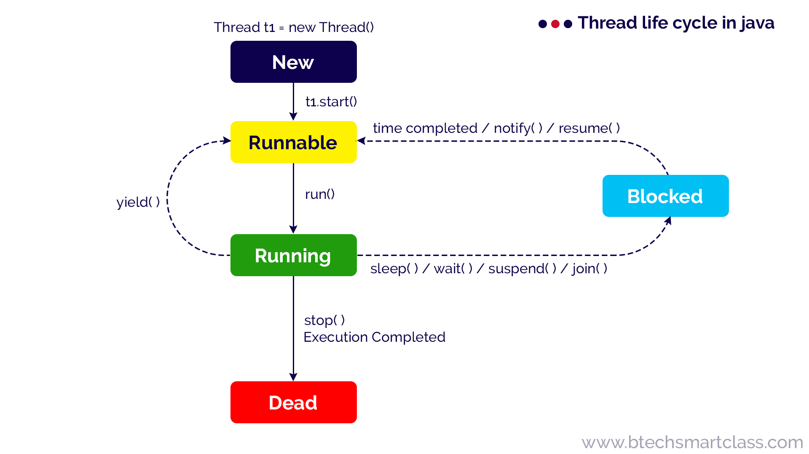
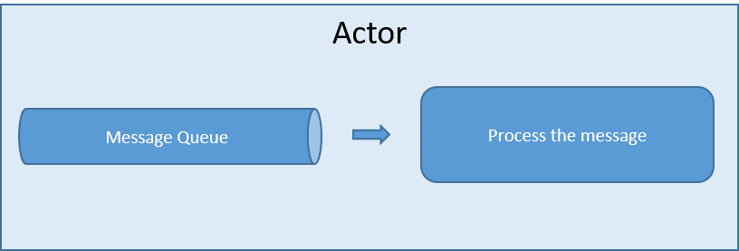

<h1> ThreadModel-ActorModel </h1>
<h2> Thread Model </h2>

 Un subproceso en un programa Java se ejecuta de forma asíncrona como una ruta de ejecución independiente.
  Es básicamente un subconjunto de código diseñado para ejecutarse simultáneamente en sincronización con otros subconjuntos del mismo programa. 
  La motivación detrás de los subprocesos es aprovechar la concurrencia. 

  

<h2> Actor Model </h2>

 El Actor Model proporciona un mayor nivel de abstracción para escribir sistemas concurrentes y distribuidos.
Evita que el desarrollador tenga que lidiar con el bloqueo explícito y la gestión de subprocesos, 
lo que facilita la escritura de sistemas paralelos y concurrentes correctos.

  

